# GTM Strategy Backtest Master Report

**Generated:** 2025-12-21 17:34:34  
**Backtest Run:** 20251221_172833

---

## Executive Summary

| Metric | Value |
|--------|-------|
| **Strategies Tested** | 4 |
| **Passed** | 0 ✅ |
| **Failed** | 4 ❌ |
| **Data Source** | Massive Historical |
| **Symbols** | 25 |
| **Trading Days** | 252 |
| **Cost Model** | 8.0 bps round-trip |
| **GPU Enabled** | ✅ Yes |

---

## Results Overview

| Strategy | Status | Net Sharpe | Max DD | Trades | Bootstrap 95% CI |
|----------|--------|------------|--------|--------|------------------|
| ATR_RSI | ❌ FAILED | 0.312 | 9.6% | 151 | [0.08, 0.88] |
| MTF_MOMENTUM | ❌ FAILED | 0.312 | 0.0% | 0 | [0.08, 0.87] |
| MI_ENSEMBLE | ❌ FAILED | 0.312 | 14.6% | 830 | [0.09, 0.91] |
| KALMAN_HYBRID | ❌ FAILED | 0.312 | 28.1% | 888 | [0.11, 0.89] |

---

## Architecture

---

## Results Visualization

```mermaid
graph LR
    subgraph Results["GTM Strategy Results"]
        ATR_RSI["❌ ATR_RSI<br/>Sharpe: 0.31<br/>DD: 9.6%"]
        MTF_MOMENTUM["❌ MTF_MOMENTUM<br/>Sharpe: 0.31<br/>DD: 0.0%"]
        MI_ENSEMBLE["❌ MI_ENSEMBLE<br/>Sharpe: 0.31<br/>DD: 14.6%"]
        KALMAN_HYBRID["❌ KALMAN_HYBRID<br/>Sharpe: 0.31<br/>DD: 28.1%"]
    end

    style ATR_RSI fill:#e74c3c,stroke:#c0392b,color:#fff
    style MTF_MOMENTUM fill:#e74c3c,stroke:#c0392b,color:#fff
    style MI_ENSEMBLE fill:#e74c3c,stroke:#c0392b,color:#fff
    style KALMAN_HYBRID fill:#e74c3c,stroke:#c0392b,color:#fff
```

---

## Visual Analysis

### Strategy Comparison

### Bootstrap Confidence Intervals

### Acceptance Criteria Heatmap

---

## Individual Strategy Reports

- [ATR_RSI Report](reports/atr_rsi_report.md)
- [MTF_MOMENTUM Report](reports/mtf_momentum_report.md)
- [MI_ENSEMBLE Report](reports/mi_ensemble_report.md)
- [KALMAN_HYBRID Report](reports/kalman_hybrid_report.md)

---

## GTM Acceptance Criteria

| Criterion | Threshold | Description |
|-----------|-----------|-------------|
| Net Sharpe | ≥ 1.0 | Risk-adjusted return after costs |
| Max Drawdown | ≤ 20% | Maximum peak-to-trough decline |
| Walk-Forward Win Rate | ≥ 60% | Out-of-sample period profitability |
| Sample Size | ≥ 500 trades | Statistical significance |
| Bootstrap CI | Lower > 0 | 95% confidence interval excludes zero |
| Stress Tests | All pass | Performance in adverse conditions |
| Lookahead Audit | Pass | No future data leakage |

---

## Recommendations

⚠️ **No strategies currently meet GTM criteria.**

**Priority Actions:**
1. Review signal generation logic for each strategy
2. Validate data pipeline for lookahead bias
3. Consider parameter optimization with walk-forward validation
4. Add more symbols to increase sample size

---

*Report generated by GTM Backtest Report Generator*
*Data source: Massive Historical Exports*
