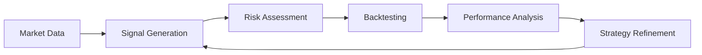

# 5. Analysis Documentation

**Last Updated:** {{ git_revision_date_localized }}

---

## 5.1 Overview

Analysis documentation including market data frameworks and backtest results.

## 5.2 Documents

| Document | Description |
|----------|-------------|
| [Analysis Framework](analysis-framework.md) | Market analysis methodology |
| [Market Data Enhancement](market-data-enhancement-plan.md) | Data pipeline improvements |
| [Backtest Results](backtest-results-20251207.md) | Latest backtest analysis |

## 5.3 Analysis Workflow

