---
# Architecture Overview
**Version:** 1.0.0
**Last Updated:** December 15, 2025
**Maintainer:** Ordinis Core Team

---

## System Architecture

Ordinis is built on a modular, layered architecture with clear separation of concerns. Each engine handles a specific aspect of the trading lifecycle.

```mermaid
graph TB
    subgraph Input ["📥 INPUT LAYER"]
        MD["Market Data<br/>(Yahoo Finance,<br/>Alpaca API)"]
        FS["Fundamental Data<br/>(Earnings,<br/>Dividends)"]
        NS["News & Sentiment<br/>(Social, RSS)"]
    end
    subgraph Engines ["⚙️ Trading Engines"]
        SC["🎯 SignalCore"]
        RG["🛡️ RiskGuard"]
        FR["🎯 FlowRoute"]
    end
    subgraph Support ["🔧 Support Systems"]
        KS["Kill Switch"]
        DB["Database"]
        LE["Learning Engine"]
    end
    subgraph External ["🌐 External"]
        AM["Alpaca Markets"]
        NVIDIA["NVIDIA NIM"]
    end
    SC --> RG
    RG --> FR
    FR --> AM
    FR --> DB
    DB --> LE
    LE --> SC
    SC -.-> NVIDIA
    style SC fill:#e3f2fd,stroke:#1565c0
    style RG fill:#fff3e0,stroke:#e65100
    style FR fill:#f3e5f5,stroke:#512da8
    style KS fill:#ffebee,stroke:#c62828
    style DB fill:#e8f5e9,stroke:#2e7d32
    style LE fill:#fce4ec,stroke:#880e4f
```



---

## Core Components

| Component | Purpose | Details |
|-----------|---------|---------|
| **[SignalCore](signalcore-system.md)** | Signal Generation | 6-model consensus voting, confidence scoring |
| **[RiskGuard](production-architecture.md)** | Risk Management | Position sizing, portfolio limits, drawdown monitoring |
| **[FlowRoute](execution-path.md)** | Order Execution | Alpaca Markets integration, order tracking |
| **Database** | Persistence | SQLite with WAL mode, transactional |
| **[Learning Engine](#)** | Continuous Improvement | Trade outcome tracking, ML-based calibration |

---

## Architecture Sections

This document merges and supersedes the previous `index.md` and `overview.md` files. For detailed engine, AI, and compliance architecture, see:

- [SignalCore System](signalcore-system.md)
- [Production Architecture](production-architecture.md)
- [Execution Path](execution-path.md)
- [AI Integration](ai-integration.md)
- [NVIDIA Integration](nvidia-integration.md)
- [Security & Compliance](security-compliance.md)
- [RAG System](rag-system.md)
- [Infrastructure](infrastructure.md)
- [Additional Plugins](additional-plugins-analysis.md)

---

## Governance & Compliance

This architecture is governed by the policies in `governance.yml`, including:
- Security controls (API keys, TLS, secrets management)
- Risk management (limits, kill switch, circuit breaker)
- AI safety (guardrails, adversarial testing)
- Documentation and review standards

For details, see [Security & Compliance](security-compliance.md).
    SC -.-> KS
    RG -.-> KS
    FR -.-> CB
    TRD --> LE
    LE --> CAL
    CAL -.->|"Feedback Loop"| SC
    CX -.->|"AI Analysis"| SC
    RAG -.->|"Knowledge"| CX
    FR --> ALERT
    TRD --> REPORT

    style Input fill:#e3f2fd,stroke:#1565c0
    style Engines fill:#fff3e0,stroke:#e65100
    style Safety fill:#ffebee,stroke:#c62828
    style Persistence fill:#e8f5e9,stroke:#2e7d32
    style AI fill:#f3e5f5,stroke:#512da8
    style Learning fill:#fce4ec,stroke:#880e4f
    style Output fill:#b2dfdb,stroke:#00695c
```

---

## Component Responsibilities

### 🎯 SignalCore
**Generates trading signals using multi-model consensus**

- 6 independent models (Fundamental, Sentiment, Algorithmic, Technical, Ichimoku, Chart Patterns)
- Confidence scoring (0-100%)
- Regime-aware model weighting
- Real-time signal generation

**Interfaces:**
- Input: Market data, fundamental data, sentiment feeds
- Output: Trading signal with confidence, direction, strength

---

### 🛡️ RiskGuard
**Manages portfolio risk and position sizing**

- Per-symbol position limits (e.g., 10% max)
- Portfolio concentration limits (100% total)
- Dynamic position sizing based on confidence
- Drawdown monitoring and alerts

**Interfaces:**
- Input: Signal confidence, account value, current positions
- Output: Position size, order quantity

---

### 🎯 FlowRoute
**Executes orders and tracks positions**

- Market/limit order routing
- Slippage and commission modeling
- Order lifecycle tracking (Created → Submitted → Filled → Closed)
- Broker integration (Alpaca Markets)

**Interfaces:**
- Input: Position size, symbol, order type
- Output: Fill price, execution report, position update

---

### 💾 Persistence Layer
**Maintains all system state and history**

```mermaid
graph TB
    DB["SQLite Database<br/>(WAL mode)"]

    subgraph Repos ["Repositories"]
        POS["📍 PositionRepository<br/>(Open positions)"]
        ORD["📋 OrderRepository<br/>(All orders)"]
        TRD["📊 TradeRepository<br/>(Closed trades)"]
        SYS["⚙️ SystemStateRepository<br/>(Runtime state)"]
    end

    DB --> POS
    DB --> ORD
    DB --> TRD
    DB --> SYS

    style DB fill:#e8f5e9,stroke:#2e7d32
    style Repos fill:#fff3e0,stroke:#e65100
```



**Features:**
- WAL (Write-Ahead Logging) mode for resilience
- Automatic backups
- Transactions for atomicity
- Repository pattern for clean access

---

### 🧠 Learning Engine
**Continuous improvement from trade outcomes**

```mermaid
graph LR
    T["Trade<br/>Executed"]
    O["📊 Outcome<br/>Recorded"]
    L["🧠 Learning<br/>Event"]
    C["📈 Calibration<br/>Update"]
    R["🔄 Model<br/>Retrained"]

    T --> O
    O --> L
    L --> C
    C --> R
    R -.->|"Feedback"| T

    style T fill:#fff3e0,stroke:#e65100
    style O fill:#f3e5f5,stroke:#512da8
    style L fill:#fce4ec,stroke:#880e4f
    style C fill:#e3f2fd,stroke:#1565c0
    style R fill:#c8e6c9,stroke:#2e7d32
```



**Process:**
1. Record trade outcome (win/loss, profit/loss %)
2. Log as learning event with all signal features
3. Retrain confidence calibration model (ML-based)
4. Update models monthly with new training data

---

### 🚨 Safety Layer
**Emergency controls and API resilience**

```mermaid
graph TB
    subgraph Triggers ["🚨 Kill Switch Triggers"]
        T1["Portfolio loss<br/>exceeds threshold"]
        T2["Single trade loss<br/>exceeds limit"]
        T3["API error rate<br/>too high"]
        T4["Manual trigger<br/>(override)"]
    end

    KS["🛑 KILL SWITCH<br/>Halt all trading<br/>Close positions"]

    CB["🔄 Circuit Breaker<br/>Retry with exponential backoff<br/>Alert on failures"]

    T1 --> KS
    T2 --> KS
    T3 --> KS
    T4 --> KS
    T3 --> CB

    style KS fill:#ffebee,stroke:#c62828,stroke-width:3px
    style CB fill:#fff3e0,stroke:#e65100
```



**Features:**
- Multi-trigger emergency halt
- Graceful shutdown
- Position reconciliation after halt
- Resilience against API failures

---

## Data Flow

### Signal Generation Cycle


### Execution Cycle


---

## Integration Points

### Alpaca Markets Integration


**Features:**
- Paper trading (practice mode)
- Live trading (real capital)
- Order tracking and verification
- Position reconciliation

### NVIDIA Integration


**Use Cases:**
- AI-powered hypothesis generation
- Research synthesis
- Trade analysis explanations
- Strategy optimization suggestions

---

## Key Design Principles

### ✅ Modularity
- Each engine is independent and testable
- Clear interfaces between components
- Can be evolved/replaced independently

### ✅ Safety
- Multi-trigger kill switch
- Position reconciliation
- Database persistence for recovery
- Comprehensive logging/auditing

### ✅ Transparency
- All decisions logged
- Confidence scores explained
- P&L tracking per trade
- Learning engine visible

### ✅ Extensibility
- New signal models can be added
- Custom risk rules supported
- Multiple execution venues
- Pluggable AI providers

---

## Next Steps

- **Understand Signals:** [SignalCore System](signalcore-system.md)
- **Learn Risk Management:** [Production Architecture](production-architecture.md)
- **See Execution Details:** [Execution Path](execution-path.md)
- **Explore AI Integration:** [NVIDIA Integration](nvidia-integration.md)
- **Learn RAG System:** [RAG System](rag-system.md)

---

*All diagrams use Mermaid and are interactive in the rendered docs.*
