# Fundamentals

**Last Updated:** December 15, 2025

---

## System Overview

Ordinis operates as an integrated pipeline with feedback loops:

```mermaid
graph LR
    A["📊 SignalCore<br/>Multi-Model Voting"] -->|"Confidence Score"| B["🛡️ RiskGuard<br/>Risk Management"]
    B -->|"Position Size"| C["🎯 FlowRoute<br/>Execution"]
    C -->|"Order Filled"| D["📈 Portfolio<br/>Tracking"]
    D -->|"Trade Outcome"| E["🧠 Learning Engine<br/>Continuous Improvement"]
    E -.->|"Calibration Update"| A

    style A fill:#e1f5ff,stroke:#01579b,color:#000
    style B fill:#fff3e0,stroke:#e65100,color:#000
    style C fill:#f3e5f5,stroke:#4a148c,color:#000
    style D fill:#e8f5e9,stroke:#1b5e20,color:#000
    style E fill:#fce4ec,stroke:#880e4f,color:#000
```



Each component makes critical decisions:
1. **SignalCore** → *"What should we trade?"* (Multi-model consensus voting)
2. **RiskGuard** → *"Can we afford it?"* (Position sizing & limits)
3. **FlowRoute** → *"How do we place the order?"* (Execution & tracking)
4. **Learning Engine** → *"Did it work?"* (Outcome recording & recalibration)

---

## Core Concepts

### Signals: Multi-Model Consensus

Rather than a single trading model, Ordinis uses **6 independent models** that vote:

```mermaid
graph TB
    subgraph Models ["6 Independent Voting Models"]
        F["📊 Fundamental<br/>Earnings, P/E, Yield"]
        S["📰 Sentiment<br/>News, Social, Bias"]
        A["📈 Algorithmic<br/>Mean Reversion, Arb"]
        T["📉 Technical<br/>MA, RSI, MACD"]
        I["☁️ Ichimoku<br/>Clouds, Support"]
        C["📐 Chart Patterns<br/>Head & Shoulders"]
    end

    V["🗳️ Voting<br/>Consensus Engine"]
    R["✅ Result<br/>Confidence 0-100%"]

    F --> V
    S --> V
    A --> V
    T --> V
    I --> V
    C --> V
    V --> R

    style F fill:#bbdefb,stroke:#1565c0,color:#000
    style S fill:#c8e6c9,stroke:#2e7d32,color:#000
    style A fill:#ffe0b2,stroke:#e65100,color:#000
    style T fill:#f8bbd0,stroke:#c2185b,color:#000
    style I fill:#b2dfdb,stroke:#00695c,color:#000
    style C fill:#e1bee7,stroke:#512da8,color:#000
    style V fill:#fff9c4,stroke:#f57f17,color:#000
    style R fill:#b2ebf2,stroke:#00838f,color:#000
```



**Voting Mechanism:**
- Each model votes: **BUY** (1), **SELL** (-1), or **NO OPINION** (0)
- Consensus score = (votes for direction) / (total models)
- **Result:** Confidence score (0-100%)

### Confidence Scores: What They Mean

| Confidence | Meaning | Trade Size |
|------------|---------|-----------|
| 0-30% | "I don't know" | Skip trade |
| 30-50% | "Weak signal" | 25% position size |
| 50-70% | "Moderate signal" | 50% position size |
| 70-85% | "Strong signal" | 75% position size |
| 85-100% | "Very strong signal" | 100% position size |

**Key insight:** Position sizing scales with confidence. High-confidence trades get larger positions.

### Market Regime: Adaptive Trading

The system detects three market states and adjusts strategy accordingly:

```mermaid
graph TB
    subgraph Bull ["🟢 BULLISH MARKET"]
        B1["📈 Rising trend<br/>Lower volatility<br/>Higher volume"]
        B2["Strategy:<br/>Trend Following<br/>BUY prioritized"]
        B3["Win Rate<br/>~62%"]
        B1 --> B2 --> B3
    end

    subgraph Side ["🟡 SIDEWAYS MARKET"]
        S1["↔️ No clear direction<br/>Choppy action<br/>Oscillating"]
        S2["Strategy:<br/>Mean Reversion<br/>Fade extremes"]
        S3["Win Rate<br/>~55%"]
        S1 --> S2 --> S3
    end

    subgraph Bear ["🔴 BEARISH MARKET"]
        Be1["📉 Falling trend<br/>High volatility<br/>Extreme swings"]
        Be2["Strategy:<br/>Selective Shorting<br/>Defensive"]
        Be3["Win Rate<br/>~55%"]
        Be1 --> Be2 --> Be3
    end

    Detect["🔍 Market Regime<br/>Detection Engine"]
    Adjust["⚙️ Auto-Adjust<br/>Which Models to Trust"]

    Detect --> Bull
    Detect --> Side
    Detect --> Bear
    Bull --> Adjust
    Side --> Adjust
    Bear --> Adjust

    style Bull fill:#c8e6c9,stroke:#2e7d32,color:#000
    style Side fill:#fff9c4,stroke:#f57f17,color:#000
    style Bear fill:#ffccbc,stroke:#d84315,color:#000
    style Detect fill:#e3f2fd,stroke:#1565c0,color:#000
    style Adjust fill:#f3e5f5,stroke:#512da8,color:#000
```



### Calibration: Knowing What We Don't Know

**Problem:** A model might say "80% confidence" but be right only 60% of the time.

**Solution:** Use ML to learn the relationship between reported confidence and actual accuracy.

**Platt Scaling:** A calibration technique that adjusts confidence scores to match reality:
- Input: Model's reported 80% confidence
- Output: Calibrated 79.7% (if that's what the data shows)

**Result:** Confidence scores are trustworthy. When we say 80%, we mean it.

---

## Risk Management: The Safety Layer

### Position Limits

- **Per-symbol limit:** Max 10% of portfolio in any one stock
- **Total limit:** Max 100% of capital deployed (rest is cash)
- **Concentration risk:** Prevents over-betting on winners

### Drawdown Protection

- **Maximum acceptable loss:** Set at portfolio initialization (e.g., -10%)
- **Kill switch:** Automatically halt trading if loss exceeds limit
- **Reset:** Manual intervention required to resume

### Order Sizing Logic

```
Position Size = (Account Size × Risk % × Confidence Score) / Stop Loss Width

Example:
- Account: $100,000
- Risk %: 2% per trade (i.e., willing to lose $2,000)
- Confidence: 80% (1.0 = 100%, so 0.8)
- Stop Loss: $50 below entry

Position Size = ($100,000 × 0.02 × 0.8) / $50 = 32 shares
```

Higher confidence = larger positions. Wider stop loss = smaller positions. Bigger account = more shares.

---

## Execution: From Signal to Filled Order

### Order Lifecycle: From Signal to Filled Order

```mermaid
graph LR
    A["🎯 Signal<br/>Generated"] -->|"BUY AAPL<br/>at market"| B["📊 Position<br/>Sizing"]
    B -->|"Buy 32 shares<br/>Confidence: 83%"| C["📤 Order<br/>Submitted"]
    C -->|"Market Order<br/>Sent to broker"| D["✅ Order<br/>Filled"]
    D -->|"Fill: $185.52<br/>+slippage"| E["📈 Position<br/>Opened"]
    E -->|"Hold 5 days<br/>Track P&L"| F["📉 Order<br/>Closed"]
    F -->|"Sold @$187.23<br/>+$887 profit"| G["📋 P&L<br/>Calculated"]
    G -->|"WIN<br/>+1.07%"| H["🧠 Learning<br/>Event Recorded"]

    style A fill:#e3f2fd,stroke:#1565c0
    style B fill:#fff3e0,stroke:#e65100
    style C fill:#f3e5f5,stroke:#512da8
    style D fill:#c8e6c9,stroke:#2e7d32
    style E fill:#fce4ec,stroke:#c2185b
    style F fill:#ffccbc,stroke:#d84315
    style G fill:#ffe0b2,stroke:#e65100
    style H fill:#b2dfdb,stroke:#00695c
```



**Key Steps:**
1. **Signal Generated** → "BUY AAPL at market"
2. **Position Sizing** → "Buy 32 shares"
3. **Order Submitted** → Sent to broker (Alpaca Markets)
4. **Order Filled** → Executed at fill price (with slippage)
5. **Position Opened** → Tracked in portfolio
6. **Order Closed** → Sold after N days (holding period)
7. **P&L Calculated** → Win or loss recorded
8. **Learning Event** → Outcome recorded for calibration

### Slippage & Commission

**Slippage:** Difference between expected fill price and actual fill price
- Reason: Market impact, latency, volatility
- Assumption: 5 basis points (0.05%) per trade

**Commission:** Broker fees
- Alpaca Markets: Typically 0 for equities in 2024
- Assumption in backtest: 10 basis points (0.1%) per trade

**Combined Cost:** ~0.15% per round-trip trade

### Holding Period

Trades are held for a fixed period before exit:
- **Default:** 5 trading days
- **Rationale:** Signals capture short-term mispricing
- **Adjustment:** Can be tuned per regime (bullish = longer holding)

---

## Learning Loop: Continuous Improvement

### Feedback Recording

Every trade generates a **learning event:**

```json
{
  "signal_id": "AAPL-2024-01-15-BUY",
  "model_votes": [1, 0, 1, 1, 0, 1],  // 4/6 voted BUY
  "confidence_score": 0.667,
  "entry_price": 185.50,
  "exit_price": 187.23,
  "pnl": "+2.95%",
  "outcome": "WIN"  // or "LOSS"
}
```

### Calibration Updates

ML model is periodically retrained on these events:

**Input:** Model confidence scores from hundreds of past trades
**Output:** Adjusted probabilities to match actual accuracy

**Example:**
- Old calibration: 70% confidence → assumed 70% win rate
- After 500 trades: Actually 75% win rate
- New calibration: 70% confidence → adjusted to 75%

### Model Retraining

Every month (or when enough new data), top-level models are retrained:

1. **Pull data:** Last 2 years of price/fundamental data
2. **Label outcomes:** Tags which trades were winners
3. **Retrain models:** Fit decision trees, RF, etc. to new data
4. **Validate:** Test on out-of-sample period
5. **Deploy:** Replace old models if validation is good

---

## Putting It Together: A Real Trade

**Scenario:** Tuesday morning, AAPL is trading at $185.50

### Step 1: Signal Generation (09:35 AM)
- Fundamental model: "AAPL is undervalued" → BUY vote
- Sentiment model: "Positive earnings surprise" → BUY vote
- Technical model: "MA crossover" → BUY vote
- Ichimoku model: "Above cloud" → BUY vote
- Pattern model: "Breakout forming" → BUY vote
- Algorithmic model: No opinion → NEUTRAL

**Result:** 5/6 models voting BUY → **Confidence = 83%**

### Step 2: Risk Sizing (09:36 AM)
- Account value: $100,000
- Risk per trade: 2% ($2,000)
- Stop loss: 2% below entry ($3.71)
- Position size: ($100,000 × 0.02 × 0.83) / $3.71 = **447 shares**

### Step 3: Execution (09:37 AM)
- Market order placed for 447 shares
- Actual fill: 447 @ $185.52 (avg price, includes slippage)
- Cost: $82,966 + commission

### Step 4: Monitoring (Next 5 days)
- Hold for 5 trading days
- Track price daily
- If hit stop loss (-2%): Close position
- If price rises: Keep holding

### Step 5: Exit & P&L (Friday close)
- Closed at $187.23
- Profit: $887 on $82,966 invested
- Return: +1.07%
- Outcome: **WIN** ✓

### Step 6: Learning (Record event)
- Event logged: "AAPL-2024-01-16-BUY: 83% confidence → WIN"
- Used for future calibration
- Confidence score validated: "83% confidence did result in win"

---

## Key Takeaways

| Concept | Meaning | Impact |
|---------|---------|--------|
| **Multi-model voting** | Reduces false signals | Higher win rate |
| **Confidence scores** | Trustworthy probabilities | Right position sizing |
| **Market regime detection** | Adaptive strategy | Better risk-adjusted returns |
| **Calibration** | Confidence matches reality | Accurate risk management |
| **Position sizing** | Scales with opportunity | Risk proportional to signal quality |
| **Learning loop** | Continuous improvement | Better performance over time |

---

## Next Steps

- [Run Your First Backtest](../guides/running-backtests.md) (See these concepts in action)
- [SignalCore Deep Dive](../architecture/signalcore-system.md) (How signals are generated)
- [Production Architecture](../architecture/production-architecture.md) (How components integrate)

---

**Ready to go deeper?** Each section above has a corresponding architecture document with code examples and implementation details.
