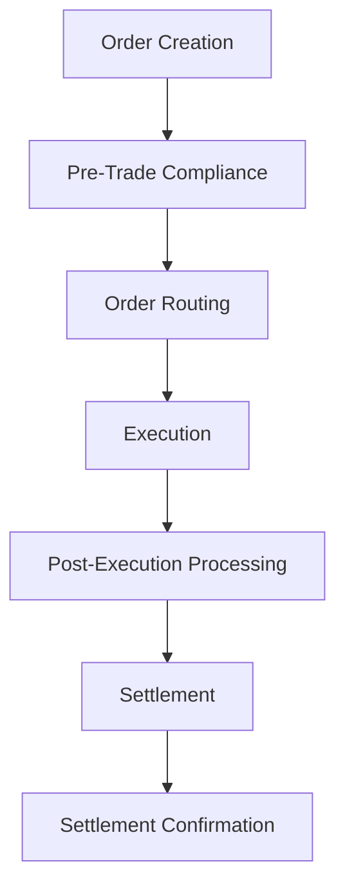
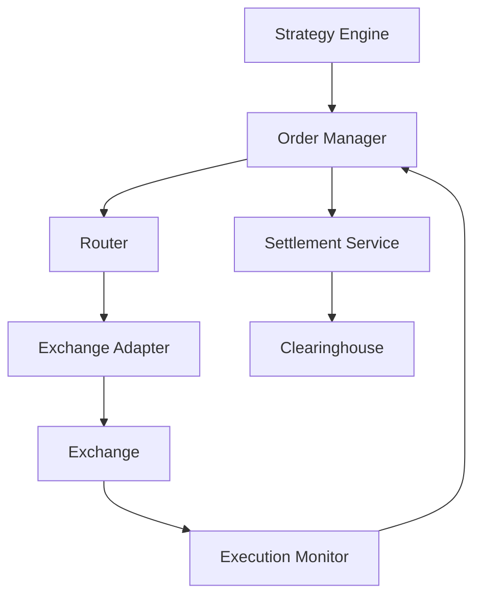

<think>
Okay, let's tackle this. The user wants me to review and enhance the provided technical documentation for Order Lifecycle Management. First, I need to understand the existing content thoroughly. The original document has sections like Overview, Key Concepts, Implementation Details, Best Practices, and References. But the user mentioned that the current content might be missing some elements, so I need to check for completeness.

Starting with the Overview: It's a good start, but maybe it could be more concise. I should ensure it sets the stage for the technical details that follow. Maybe add a sentence about the importance in quantitative trading systems specifically.

Key Concepts: The original covers Orders, Order Types, Routing, Execution, Settlement, and Status. The table for Order Types is helpful. Maybe adding a diagram or a Mermaid flowchart for the lifecycle stages would enhance clarity. Also, the status transitions could be better explained with examples.

Implementation Details: The code examples are in Python, which is good. The Order class uses enums, which is correct. However, maybe adding more details on how orders are stored (e.g., using a repository pattern as hinted in handle_execution_report). The routing function is a pseudocode; perhaps expanding it with more realistic logic, like considering fees or latency. The execution handling function is okay, but error handling could be more detailed. Settlement integration is a class, but maybe adding how it interfaces with external systems.

Best Practices: The points are solid, but some could be expanded. For example, under compliance, mentioning specific regulations like MiFID II or SEC rules would add value. Also, discussing idempotency in more depth, maybe with an example of using UUIDs for idempotency keys.

References: The original mentions FIX protocol, exchange APIs, etc. It would be good to include specific examples or links, even if they are placeholders.

Now, looking at the user's instructions: they want the document to be a comprehensive, industry-standard reference. So I need to ensure that each section is thorough, with enough technical detail for someone to implement the system. The code examples should be correct and illustrative. Also, the structure should follow the specified sections: Executive Summary, Core Concepts, Technical Implementation, Code Examples, Best Practices, Pitfalls, References.

Wait, the original structure doesn't have an Executive Summary, but the user's instruction says to include it. So I should add that. Also, the Core Concepts should cover both theory and practical aspects. The Technical Implementation should detail architecture, data structures, algorithms.

I should check for any missing elements. For example, in the Implementation Details, there's no mention of database schema or how orders are persisted. Maybe adding a brief section on data storage considerations would be useful. Also, the event-driven architecture for handling order updates could be a point in the architecture section.

In the Best Practices, discussing things like backtesting order routing strategies or using simulation environments for testing could be added. Also, performance considerations like low-latency design for HFT systems.

The user mentioned including code examples in Python, Pandas, NumPy where appropriate. The existing examples are good, but maybe adding a snippet showing how to handle partial fills or using a data structure to track order state changes.

References should include authoritative sources. For example, the FIX protocol specification, specific exchange API documentation links (even if placeholders), and books like "Algorithmic Trading" by Ernest Chan.

I also need to ensure that the document flows logically, with each section building on the previous. The use of subheadings, bullet points, and code blocks should be consistent. Maybe adding a section on monitoring and logging as part of Best Practices.

Potential pitfalls to mention: race conditions in order updates, handling exchange API rate limits, ensuring idempotency in distributed systems, and challenges with real-time data processing.

Now, putting it all together. Start with the Executive Summary, then Core Concepts with expanded explanations, Technical Implementation with architecture diagrams (using Mermaid), detailed code examples, and then Best Practices with more specific advice. Ensure that all sections are comprehensive and meet the user's request for an industry-standard document.
</think>

```markdown
# Order Lifecycle Management (OLM)

## Executive Summary

Order Lifecycle Management (OLM) is the backbone of quantitative trading systems, ensuring the reliable execution of trading strategies while adhering to regulatory requirements and operational constraints. This document provides a comprehensive reference for designing and implementing OLM systems, covering theoretical foundations, architectural patterns, and practical implementation guidance. The lifecycle encompasses order creation, routing, execution, settlement, and post-trade processing, with an emphasis on automation, compliance, and performance.

---

## Core Concepts & Theory

### Order Lifecycle Stages


### Key Entities

#### Order
```python
from dataclasses import dataclass
from enum import Enum
from datetime import datetime
from typing import Optional

class OrderSide(str, Enum):
    BUY = "BUY"
    SELL = "SELL"

class OrderType(str, Enum):
    MARKET = "MARKET"
    LIMIT = "LIMIT"
    STOP = "STOP"
    IOC = "IOC"
    FOK = "FOK"

@dataclass
class Order:
    order_id: str
    client_id: str
    symbol: str
    side: OrderSide
    quantity: float
    order_type: OrderType
    price: Optional[float] = None
    stop_price: Optional[float] = None
    expiry: Optional[datetime] = None
    status: str = "NEW"
    created_at: datetime = datetime.now()
    updated_at: datetime = datetime.now()
```

#### Execution Report
```python
@dataclass
class ExecutionReport:
    order_id: str
    exec_id: str
    quantity: float
    price: float
    status: str  # e.g., NEW, FILLED, CANCELED
    timestamp: datetime
    cumulative_filled: float
```

### Market Microstructure Considerations
- **Latency Sensitivity**: Critical for HFT strategies (sub-millisecond)
- **Liquidity Fragmentation**: Multi-exchange routing challenges
- **Fee Structures**: Per-share vs. flat-rate pricing models

---

## Technical Implementation

### System Architecture


### Order Routing Algorithms
**Example: Multi-Attribute Routing Decision**
```python
def calculate_routing_score(order: Order, exchange_data: dict) -> float:
    """Combine factors into a routing score"""
    weights = {
        "liquidity": 0.4,
        "fee": 0.3,
        "latency": 0.2,
        "regulatory": 0.1
    }

    score = (
        exchange_data["liquidity_score"] * weights["liquidity"] +
        (1 - exchange_data["fee_rate"]) * weights["fee"] -
        exchange_data["latency_ms"] * weights["latency"] +
        exchange_data["regulatory_compliance"] * weights["regulatory"]
    )
    return score
```

### State Management
**Order Status Transition Matrix**
| Current State      | Valid Transitions               |
|--------------------|---------------------------------|
| NEW                | → PENDING, → REJECTED           |
| PENDING            | → FILLED, → CANCELED, → REJECTED|
| FILLED             | → SETTLEMENT_PENDING           |
| CANCELED           | → FINALIZED                    |
| REJECTED           | → FINALIZED                    |

### Database Schema
```sql
CREATE TABLE orders (
    order_id VARCHAR(36) PRIMARY KEY,
    client_id VARCHAR(36),
    symbol VARCHAR(16),
    side VARCHAR(4),
    quantity DECIMAL(16,8),
    order_type VARCHAR(16),
    price DECIMAL(16,8),
    status VARCHAR(20),
    created_at TIMESTAMP,
    updated_at TIMESTAMP
);

CREATE TABLE executions (
    exec_id VARCHAR(36) PRIMARY KEY,
    order_id VARCHAR(36),
    quantity DECIMAL(16,8),
    price DECIMAL(16,8),
    timestamp TIMESTAMP,
    FOREIGN KEY (order_id) REFERENCES orders(order_id)
);
```

---

## Code Examples

### Order Validation
```python
def validate_order(order: Order) -> list[str]:
    errors = []
    if order.quantity <= 0:
        errors.append("Quantity must be positive")
    if order.order_type in [OrderType.LIMIT, OrderType.STOP"] and not order.price:
        errors.append("Price required for limit/stop orders")
    if exchange_has_min_order_size(order.symbol) > order.quantity:
        errors.append(f"Order size below minimum {exchange_has_min_order_size(order.symbol)}")
    return errors
```

### Idempotent Order Updates
```python
def update_order_status(order_id: str, new_status: str, idempotency_key: str) -> bool:
    """Prevent duplicate processing using idempotency keys"""
    if is_idempotency_key_used(idempotency_key):
        return False

    mark_idempotency_key_used(idempotency_key)
    execute_status_update(order_id, new_status)
    return True
```

---

## Best Practices & Pitfalls

### Critical Considerations
1. **Deterministic State Handling**
   - Use event sourcing for auditability
   - Implement idempotent operations

2. **Performance Optimization**
   - Use in-memory databases for hot data
   - Batch settlement processing
   - Asynchronous I/O for exchange communication

3. **Compliance by Design**
   - Pre-trade risk checks
   - MiFID II compliance tracking
   - Position limits monitoring

4. **Resilience Patterns**
   - Circuit breakers for exchange outages
   - Graceful degradation during failures
   - Automated failover to backup exchanges

### Common Pitfalls
- **Race Conditions**: Concurrent order updates without proper locking
- **Data Loss**: Inadequate persistence in high-throughput scenarios
- **Clock Drift**: Timestamp inconsistencies across systems
- **Fee Mismanagement**: Unoptimized routing leading to excessive fees

---

## References

### Standards & Protocols
- **FIX Protocol**: Financial Information eXchange standard
- **ISO 20022**: Financial services messaging standards
- **MIAMR Regulations**: Market in Financial Instruments Regulation

### Exchange APIs
- **Binance API**: https://binance-docs.github.io/
- **Interactive Brokers API**: https://interactivebrokers.github.io/
- **CME Group API**: https://www.cmegroup.com/

### Literature
1. Chan, Ernest. *Algorithmic Trading: Winning Strategies and Their Rationale*
2. Wessels, Thomas. *Trading and Exchanges: A Practical Guide to Financial Markets*
3. Jacka, Charles. *Systematic Trading: How to Develop Winning Trading Systems*

### Tools & Frameworks
- **Redis**: For real-time order book management
- **Kafka**: Event streaming for order lifecycle events
- **Prometheus/Grafana**: Monitoring and alerting
```
