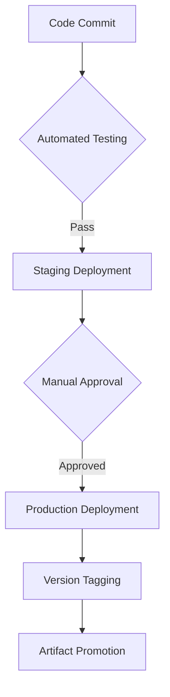

<think>
Okay, let me start by reviewing the input document provided. The user wants me to act as a Senior Quantitative Trading Architect and Technical Writer to enhance the existing technical documentation on strategy version control, A/B testing, and rollback procedures.

First, I'll read through the current content to understand what's already there. The original document has sections like Overview, Key Concepts, Implementation Details, Best Practices, and References. The Key Concepts cover versioning strategies, A/B testing, and rollback procedures. Implementation Details include code examples and pseudo-code. Best Practices list guidelines, and References point to tools and literature.

Now, I need to identify areas for improvement. The user mentioned enhancing the document to be a comprehensive, industry-standard reference. So, I should check if there are missing key concepts, practical examples, or implementation details. Let me go through each section.

Starting with the Overview: It's concise but could benefit from a more detailed explanation of why these processes are critical in quantitative trading. Maybe mention the risks of not having proper version control or rollback mechanisms, such as financial losses or system downtime.

Key Concepts: The current section defines the three main areas but could be expanded. For versioning strategies, perhaps discuss branch strategies like GitFlow. For A/B testing, maybe include types of A/B tests (e.g., split testing, champion-challenger). Rollback procedures might need more on blue/green deployments or canary releases.

Implementation Details: The code examples are good but could be more comprehensive. The Python example for A/B testing uses a backtesting library, but maybe include a live trading example or more metrics. The rollback pseudo-code is basic; perhaps add more steps like database migrations or state restoration.

Best Practices: The list is solid, but adding more specific advice, such as using feature flags, monitoring specific metrics, or integrating with CI/CD pipelines, would help. Also, mentioning compliance and audit aspects could be important for financial systems.

References: The current references are good, but adding more specific resources, like books on algorithmic trading or specific papers on A/B testing in finance, would enhance credibility.

Now, considering the structure the user wants: Executive Summary, Core Concepts & Theory, Technical Implementation Details (including architecture, data structures, algorithms), Code Examples, Best Practices & Pitfalls, and References. The original document doesn't have an Executive Summary, so that should be added. Core Concepts should delve deeper into the theory behind versioning, A/B testing methodologies, and rollback strategies.

In Technical Implementation Details, perhaps include architectural diagrams (though in Markdown, maybe describe them) or more detailed algorithms for routing trades during A/B tests. Data structures for tracking versions and dependencies could be discussed, like using version control systems or artifact repositories.

Code Examples: The existing Python example is good, but adding more realistic scenarios, such as integrating with a trading API or handling live data streams, would be beneficial. Also, showing how to analyze results statistically to determine significance.

Best Practices & Pitfalls: Highlight common mistakes, like not testing rollback procedures or inadequate monitoring during A/B tests. Emphasize the importance of idempotency in deployment scripts.

References: Expand to include more authoritative sources, perhaps specific to financial systems or quantitative trading.

I also need to ensure that the document flows logically, each section builds on the previous one, and technical terms are well-defined. Using subheadings, bullet points, and code blocks appropriately will enhance readability.

Potential gaps in the original document:
- Lack of discussion on data versioning alongside code versioning.
- No mention of collaboration workflows in version control (code reviews, pull requests).
- Limited detail on metrics for A/B testing beyond basic financial metrics.
- Rollback procedures could include more on database versioning and schema migrations.
- Security considerations in deployment and rollback processes.

I should address these gaps in the enhanced document. Also, ensure that all code examples are correct and relevant. For instance, the A/B testing example uses a backtesting library, but in live systems, the approach might differ, so including both backtesting and live deployment examples would be useful.

Another point is the use of infrastructure as code (IaC) for consistent environments, which ties into versioning and rollback. Mentioning tools like Terraform or AWS CloudFormation could be relevant.

Lastly, compliance and audit trails are crucial in financial systems. The document should touch on how versioning and rollback procedures support regulatory requirements, such as the ability to recreate past states of the system for audits.

With these considerations in mind, I'll restructure and expand the document to cover all these aspects, ensuring it's comprehensive and meets industry standards.
</think>

```markdown
# Version Control, A/B Testing, and Rollback Procedures for Quantitative Trading Systems

## Executive Summary

In quantitative trading, the ability to safely evolve strategies, validate changes through A/B testing, and rapidly recover from failures is critical to maintaining a competitive edge and minimizing operational risk. This document establishes a comprehensive framework for version control, A/B testing, and rollback procedures, incorporating industry best practices and battle-tested engineering principles. It is designed for architects, quantitative researchers, and trading system engineers responsible for deploying and maintaining algorithmic trading systems.

---

## Core Concepts & Theory

### 1. Version Control in Trading Systems

#### a. Semantic Versioning (SemVer)
- **MAJOR.MINOR.PATCH** versioning for strategy artifacts:
  - **MAJOR**: Breaking changes (e.g., changes in trade execution logic)
  - **MINOR**: Backward-compatible enhancements (e.g., parameter optimizations)
  - **PATCH**: Bug fixes (e.g., error handling improvements)
- **Version Tagging**: Immutable tags for production deployments (e.g., `strategy/v3.1.2`)

#### b. Branching Strategies
- **Mainline Development**:
  - Single `main` branch with feature flags for controlled releases
  - Automated testing gates before merge
- **Release Branches**:
  - Dedicated branches for production releases with pinned dependencies

#### c. Dependency Management
- **Lock Files**: Use `requirements.txt`, `package-lock.json`, or `Pipfile.lock`
- **Containerization**: Docker images with versioned base images
- **Artifact Repositories**: Nexus or Artifactory for internal package hosting

### 2. A/B Testing Methodology

#### a. Experimental Design
- **Split Testing**: Equal allocation of trades between strategy versions
- **Shadow Mode**: Run new strategy in simulation alongside live system
- **Time-Series Analysis**: Compare performance across market regimes

#### b. Performance Metrics
| Metric                | Formula/Description                          | Risk-Adjusted Focus |
|-----------------------|----------------------------------------------|---------------------|
| Sharpe Ratio          | (Mean Return - Risk-Free Rate) / Std Dev     | Volatility         |
| Sortino Ratio         | (Mean Return - Target) / Downside Deviation | Downside Risk      |
| Maximum Drawdown      | Peak-to-trough decline                       | Ruin Risk          |
| Information Ratio     | Active Return / Tracking Error               | Benchmark Alignment|

#### c. Statistical Validation
- **Hypothesis Testing**: Use t-tests or Mann-Whitney U test for non-normal returns
- **Sample Size Calculation**: Ensure >95% power to detect material differences
- **Overfitting Prevention**: Walk-forward optimization and out-of-sample testing

### 3. Rollback Engineering

#### a. Failure Modes
- **Logic Errors**: Incorrect trade execution or position sizing
- **Data Pipeline Issues**: Missing/corrupted market data feeds
- **Performance Degradation**: Increased latency or resource exhaustion

#### b. Rollback Strategies
- **Blue/Green Deployment**: Instant switch between identical environments
- **Canary Releases**: Gradual rollout with automated rollback triggers
- **Database Migrations**: Forward/backward-compatible schema changes

#### c. Recovery SLAs
- **RTO (Recovery Time Objective)**: <5 minutes for critical components
- **RPO (Recovery Point Objective)**: <1 minute data loss tolerance

---

## Technical Implementation Details

### Version Control Architecture

#### a. Codebase Structure
```bash
trading_system/
├── strategies/
│   ├── base_strategy.py
│   ├── legacy/
│   │   └── v1.0.0/
│   └── current/
│       └── v3.2.1/  # Active version
├── data_adapters/
├── execution_engines/
└── version_manager.py  # Version orchestration logic
```

#### b. CI/CD Pipeline


### A/B Testing Framework

#### a. Live Trade Routing
```python
# Strategy router with statistical allocation
import hashlib

def route_trade(order):
    # Consistent hashing for deterministic allocation
    hash_id = hashlib.md5(order.account_id.encode()).hexdigest()
    allocation = int(hash_id, 16) % 100

    if allocation < 50:
        return StrategyV1(order)
    elif 50 <= allocation < 80:
        return StrategyV2(order)
    else:
        return StrategyV3(order)  # Control group
```

#### b. Performance Comparison
```python
import pandas as pd
from scipy.stats import ttest_ind

def compare_strategies(results_a, results_b):
    # Statistical comparison of returns
    returns_a = results_a['returns']
    returns_b = results_b['returns']

    stat, p_value = ttest_ind(returns_a, returns_b)
    print(f"P-value: {p_value:.4f}")
    print(f"Effect Size: {(returns_a.mean() - returns_b.mean()):.2%}")

    if p_value < 0.05:
        print("Statistically significant difference detected")
    else:
        print("No significant difference found")
```

### Rollback System

#### a. Automated Rollback Engine
```python
class RollbackController:
    def __init__(self, current_version, previous_version):
        self.current = current_version
        self.previous = previous_version
        self.health_checks = [
            self.check_latency,
            self.check_error_rate,
            self.check_performance_threshold
        ]

    def check_health(self):
        for check in self.health_checks:
            if not check():
                self.trigger_rollback()
                return False
        return True

    def trigger_rollback(self):
        self.revert_git_tag()
        self.restore_database()
        self.restart_services()
        self.notify_teams()

    def restore_database(self):
        # Database-specific rollback logic
        if self._is_database_compatible(self.previous):
            self._execute_sql(f"RESTORE FROM {self.previous}")
        else:
            raise IncompatibleVersionError
```

#### b. Database Versioning
```sql
-- Versioned schema with migration scripts
CREATE TABLE IF NOT EXISTS strategy_parameters (
    version INT PRIMARY KEY,
    params JSON,
    created_at TIMESTAMP DEFAULT CURRENT_TIMESTAMP,
    checksum TEXT
);

-- Migration example
BEGIN;
CREATE TABLE strategy_parameters_v2 (
    id SERIAL PRIMARY KEY,
    version INT REFERENCES strategy_parameters(version),
    params JSONB,
    valid_from TIMESTAMP,
    valid_to TIMESTAMP
);
COMMIT;
```

---

## Best Practices & Pitfalls

### Version Control
- **Pitfall**: Version drift between environments
  - **Solution**: Use infrastructure-as-code (IaC) for identical environments
- **Pitfall**: Untracked dependencies
  - **Solution**: Containerize all components with pinned base images

### A/B Testing
- **Pitfall**: Survivorship bias in historical testing
  - **Solution**: Include delisted securities in backtests
- **Pitfall**: Over-optimization to test metrics
  - **Solution**: Use walk-forward analysis with multiple out-of-sample periods

### Rollback Procedures
- **Pitfall**: Downtime during rollback
  - **Solution**: Implement stateless services with hot standby instances
- **Pitfall**: Data inconsistency
  - **Solution**: Use transactional updates and database snapshots

### General
- **Pitfall**: Lack of audit trail
  - **Solution**: Maintain versioned documentation and deployment logs
- **Pitfall**: Insufficient testing
  - **Solution**: Chaos engineering for failure scenario testing

---

## References

### 1. Tools & Frameworks
- **Version Control**: Git, GitHub Actions, GitLab CI
- **Containerization**: Docker, Kubernetes
- **Monitoring**: Prometheus, Grafana, ELK Stack
- **Testing**: Backtrader, Zipline, PyAlgoTrade

### 2. Academic & Industry Resources
- **Books**:
  - *Advances in Financial Machine Learning* (Marc López de Prado) - A/B testing in finance
  - *Designing Data-Intensive Applications* (Martin Kleppmann) - Database versioning
  - *Site Reliability Engineering* (Google) - Rollback engineering
- **Papers**:
  - "Evaluating Trading Strategies with the Sharpe Ratio" (Burton G. Malkiel)
  - "Statistical Arbitrage in High-Frequency Trading" (L. Zhang et al.)

### 3. Standards & Compliance
- **ISO/IEC 19770-1**: Software asset management
- **MiFID II**: Trade audit requirements
- **SOX Compliance**: Version control for financial systems

### 4. Additional Resources
- [QuantStackLib](https://quantstack.org/) - Open-source trading infrastructure
- [Kubernetes Rollout Strategies](https://kubernetes.io/docs/concepts/workloads/controllers/deployment/#strategy)
- [Python Testing in Finance](https://pypi.org/project/pyfolio/)
```
