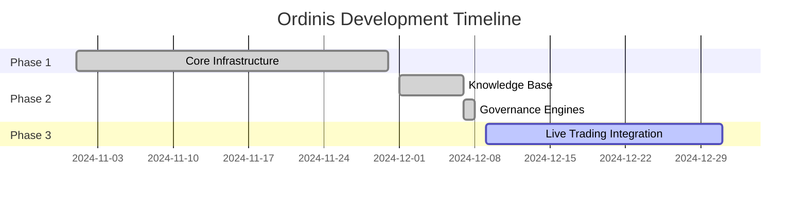

# 1. Project Documentation

**Last Updated:** {{ git_revision_date_localized }}

---

## 1.1 Overview

This section contains project management documentation including scope, status reports, and development workflows.

## 1.2 Documents

| Document | Description |
|----------|-------------|
| [Project Scope](PROJECT_SCOPE.md) | System objectives and boundaries |
| [Status Report](PROJECT_STATUS_REPORT.md) | Current project status |
| [Current Status](CURRENT_STATUS_AND_NEXT_STEPS.md) | Immediate status and next steps |
| [Branch Workflow](BRANCH_WORKFLOW.md) | Git branching strategy |

## 1.3 Project Timeline

## 1.4 Version

- **Current Version:** 0.2.0-dev
- **Target Release:** 0.3.0 (Live Trading Ready)
