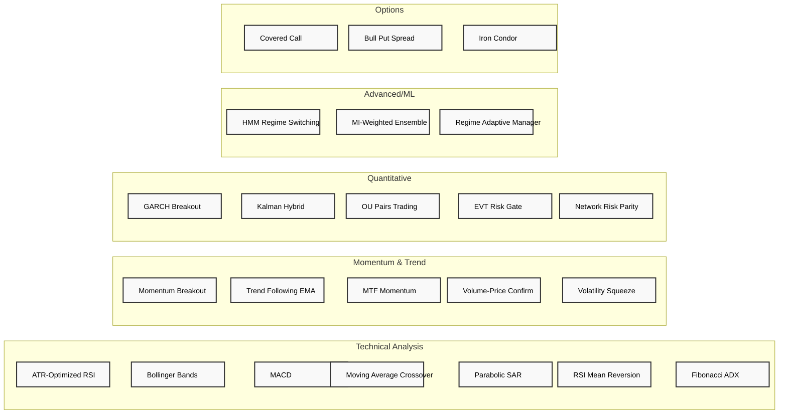

# Ordinis Strategy Suite

---

**Title:** Complete Trading Strategy Library
**Description:** Master index and classification of all trading strategies in the Ordinis platform
**Author:** Ordinis Quantitative Research
**Version:** 2.0.0
**Date:** 2025-12-25
**Status:** current
**Tags:** strategies, index, classification, signalcore, application-strategies
**References:** See individual strategy documentation for academic references

---

## Overview

This document serves as the master index for all trading strategies implemented in the Ordinis platform. The suite contains **21 documented strategies** across multiple categories, with implementations in both the Application Strategies layer (`src/ordinis/application/strategies/`) and the SignalCore Models layer (`src/ordinis/engines/signalcore/models/`).

---

## Strategy Classification



---

## Summary by Category

| Category | Count | Strategies | Primary Use Case |
|----------|-------|------------|------------------|
| **Technical Analysis** | 7 | ATR-RSI, Bollinger Bands, MACD, MA Crossover, Parabolic SAR, RSI Mean Reversion, Fibonacci ADX | Classic indicator-based signals |
| **Momentum & Trend** | 5 | Momentum Breakout, Trend Following EMA, MTF Momentum, Volume-Price Confirm, Volatility Squeeze | Trend capture & breakout detection |
| **Quantitative** | 5 | GARCH Breakout, Kalman Hybrid, OU Pairs, EVT Risk Gate, Network Risk Parity | Statistical & volatility modeling |
| **Advanced/ML** | 3 | HMM Regime, MI Ensemble, Regime Adaptive Manager | Regime detection & meta-strategies |
| **Options** | 3 | Covered Call, Bull Put Spread, Iron Condor | Options income & hedging |
| **Total** | **23** | — | — |

---

## Complete Strategy Index

### Technical Analysis Strategies

| Strategy | Implementation | Status | Complexity | Documentation |
|----------|---------------|--------|------------|---------------|
| **ATR-Optimized RSI** | `signalcore/models/atr_optimized_rsi.py` | ✅ Production | ⭐⭐ | [ATR-RSI/](./ATR-RSI/) |
| **Bollinger Bands** | `application/strategies/bollinger_bands.py`, `signalcore/models/bollinger_bands.py` | ✅ Complete | ⭐⭐ | [BOLLINGER_BANDS/](./BOLLINGER_BANDS/) |
| **MACD** | `application/strategies/macd.py`, `signalcore/models/macd.py` | ✅ Complete | ⭐⭐ | [MACD/](./MACD/) |
| **Moving Average Crossover** | `application/strategies/moving_average_crossover.py`, `signalcore/models/sma_crossover.py` | ✅ Complete | ⭐ | [MOVING_AVERAGE_CROSSOVER/](./MOVING_AVERAGE_CROSSOVER/) |
| **Parabolic SAR** | `application/strategies/parabolic_sar_trend.py`, `signalcore/models/parabolic_sar.py` | ✅ Complete | ⭐⭐ | [PARABOLIC_SAR/](./PARABOLIC_SAR/) |
| **RSI Mean Reversion** | `application/strategies/rsi_mean_reversion.py`, `signalcore/models/rsi_mean_reversion.py` | ✅ Complete | ⭐⭐ | [RSI_MEAN_REVERSION/](./RSI_MEAN_REVERSION/) |
| **Fibonacci ADX** | `application/strategies/fibonacci_adx.py`, `signalcore/models/fibonacci_retracement.py` | ✅ Complete | ⭐⭐⭐ | [FIBONACCI_ADX/](./FIBONACCI_ADX/) |

### Momentum & Trend Strategies

| Strategy | Implementation | Status | Complexity | Documentation |
|----------|---------------|--------|------------|---------------|
| **Momentum Breakout** | `application/strategies/momentum_breakout.py`, `signalcore/models/momentum_breakout.py` | ✅ Complete | ⭐⭐ | [MOMENTUM_BREAKOUT/](./MOMENTUM_BREAKOUT/) |
| **Trend Following EMA** | `signalcore/models/trend_following.py` | ✅ Complete | ⭐⭐ | [TREND_FOLLOWING_EMA/](./TREND_FOLLOWING_EMA/) |
| **Multi-Timeframe Momentum** | `signalcore/models/mtf_momentum.py` | ✅ Complete | ⭐⭐⭐ | [MTF_MOMENTUM/](./MTF_MOMENTUM/) |
| **Volume-Price Confirm** | `signalcore/models/volume_trend.py` | ✅ Complete | ⭐⭐ | [VOLUME_PRICE_CONFIRM/](./VOLUME_PRICE_CONFIRM/) |
| **Volatility Squeeze** | `signalcore/models/atr_breakout.py` | ✅ Complete | ⭐⭐⭐ | [VOLATILITY_SQUEEZE/](./VOLATILITY_SQUEEZE/) |

### Quantitative Strategies

| Strategy | Implementation | Status | Complexity | Documentation |
|----------|---------------|--------|------------|---------------|
| **GARCH Volatility Breakout** | `signalcore/models/garch_breakout.py` | ✅ Complete | ⭐⭐⭐ | [GARCH_BREAKOUT/](./GARCH_BREAKOUT/) |
| **Kalman Filter Hybrid** | `signalcore/models/kalman_hybrid.py` | ✅ Complete | ⭐⭐⭐⭐ | [KALMAN_HYBRID/](./KALMAN_HYBRID/) |
| **OU Pairs Trading** | `signalcore/models/ou_pairs.py` | ✅ Complete | ⭐⭐⭐⭐ | [OU_PAIRS/](./OU_PAIRS/) |
| **EVT Risk Gate** | `signalcore/models/evt_risk_gate.py` | ✅ Complete | ⭐⭐⭐ | [EVT_RISK_GATE/](./EVT_RISK_GATE/) |
| **Network Risk Parity** | `signalcore/models/network_parity.py` | ✅ Complete | ⭐⭐⭐⭐ | [NETWORK_PARITY/](./NETWORK_PARITY/) |

### Advanced / Machine Learning Strategies

| Strategy | Implementation | Status | Complexity | Documentation |
|----------|---------------|--------|------------|---------------|
| **HMM Regime Switching** | `signalcore/models/hmm_regime.py` | ✅ Complete | ⭐⭐⭐⭐ | [HMM_REGIME/](./HMM_REGIME/) |
| **MI-Weighted Ensemble** | `signalcore/models/mi_ensemble.py` | ✅ Complete | ⭐⭐⭐⭐ | [MI_ENSEMBLE/](./MI_ENSEMBLE/) |
| **Regime Adaptive Manager** | `application/strategies/regime_adaptive/` | ✅ Complete | ⭐⭐⭐⭐⭐ | [REGIME_ADAPTIVE_MANAGER/](./REGIME_ADAPTIVE_MANAGER/) |

### Options Strategies

| Strategy | Implementation | Status | Complexity | Documentation |
|----------|---------------|--------|------------|---------------|
| **Covered Call** | `signalcore/models/options_signal.py` | ✅ Complete | ⭐⭐⭐ | [OPTIONS_TRADING/COVERED_CALL.md](./OPTIONS_TRADING/COVERED_CALL.md) |
| **Bull Put Spread** | `signalcore/models/options_signal.py` | ✅ Complete | ⭐⭐⭐ | [OPTIONS_TRADING/BULL_PUT_SPREAD.md](./OPTIONS_TRADING/BULL_PUT_SPREAD.md) |
| **Iron Condor** | `signalcore/models/options_signal.py` | ✅ Complete | ⭐⭐⭐⭐ | [OPTIONS_TRADING/IRON_CONDOR.md](./OPTIONS_TRADING/IRON_CONDOR.md) |

---

## Strategy Summaries

### 1. ATR-Optimized RSI Mean Reversion
**Location:** `src/ordinis/engines/signalcore/models/atr_optimized_rsi.py`

Mean reversion strategy using RSI<35 entry with ATR-based adaptive stops. Regime-filtered to avoid choppy markets.

**Key Parameters:**
- RSI threshold: 35 (entry), 50 (exit)
- ATR stop multiplier: 1.5×
- ATR take-profit: 1.5-3.0× (per symbol)

**Performance:** +60.1% return, 70-85% win rate, 26.1% max drawdown

---

### 2. GARCH Volatility Breakout
**Location:** `src/ordinis/engines/signalcore/models/garch_breakout.py`

Trades volatility expansions when realized volatility exceeds GARCH(1,1) forecast by >2σ. Direction determined by recent price move.

**Key Parameters:**
- GARCH(1,1) lookback: 252 days
- Breakout threshold: 2.0× forecast
- Realized vol window: 5 days

**Edge:** Captures regime changes as GARCH forecast lags reality.

---

### 3. EVT Risk Gate
**Location:** `src/ordinis/engines/signalcore/models/evt_risk_gate.py`

Overlay strategy using Generalized Pareto Distribution to estimate tail risk. Reduces position sizes when VaR or tail shape exceeds thresholds.

**Key Parameters:**
- GPD threshold: 95th percentile
- VaR confidence: 99%
- Alert triggers: VaR>3% or ξ>0.3

**Edge:** Better tail risk estimation than Gaussian VaR.

---

### 4. Multi-Timeframe Momentum
**Location:** `src/ordinis/engines/signalcore/models/mtf_momentum.py`

Combines daily momentum ranking (12-1 month) with intraday stochastic oscillator for entry timing. Only enters momentum trades when stochastic confirms.

**Key Parameters:**
- Momentum: 12-1 month return
- Stochastic: 14-period %K, 3-period %D
- Entry: Winner + bullish cross + oversold

**Edge:** Better entry prices via stochastic pullback confirmation.

---

### 5. Kalman Filter Hybrid
**Location:** `src/ordinis/engines/signalcore/models/kalman_hybrid.py`

Decomposes price into trend and residual using Kalman filter. Mean-reverts residual only when aligned with trend direction.

**Key Parameters:**
- Process noise (Q): 1e-6
- Observation noise (R): 1e-3
- Residual z-score threshold: 2.0

**Edge:** Avoids counter-trend mean reversion trades.

---

### 6. OU Pairs Trading
**Location:** `src/ordinis/engines/signalcore/models/ou_pairs.py`

Pairs trading with Ornstein-Uhlenbeck parameter estimation. Uses half-life to set dynamic thresholds and maximum holding periods.

**Key Parameters:**
- Cointegration p-value: <0.05
- Half-life filter: <10 days
- Entry z-score: 2.0 (dynamic)

**Edge:** Adapts to spread dynamics; avoids slow-reverting pairs.

---

### 7. MI-Weighted Ensemble
**Location:** `src/ordinis/engines/signalcore/models/mi_ensemble.py`

Meta-strategy combining multiple signals weighted by mutual information with future returns. Penalizes redundant signals.

**Key Parameters:**
- Base signals: RSI, Stochastic, Momentum, Volatility
- MI rolling window: 252 days
- Redundancy penalty: correlation-based

**Edge:** Information-theoretic signal combination; captures non-linear dependencies.

---

### 8. HMM Regime Switching
**Location:** `src/ordinis/engines/signalcore/models/hmm_regime.py`

3-state Hidden Markov Model for regime detection. Switches between strategies based on regime probability.

**Key Parameters:**
- States: Bull, Bear, Neutral
- Strategy mapping: Bull→Momentum, Bear→Mean Reversion
- Transition threshold: 60% probability

**Edge:** Probabilistic regime detection with strategy rotation.

---

### 9. Network Risk Parity
**Location:** `src/ordinis/engines/signalcore/models/network_parity.py`

Portfolio allocation using correlation network centrality. Underweights highly central (systemic) assets; overweights peripheral assets.

**Key Parameters:**
- Centrality: Eigenvector
- Correlation shrinkage: 10%
- Weight smoothing: 20% blend

**Edge:** Systemic risk awareness; diversification maximization.

---

### 10. Fibonacci ADX
**Location:** `src/ordinis/application/strategies/fibonacci_adx.py`

Combines Fibonacci retracement levels with ADX trend confirmation. Enters at key Fibonacci levels when ADX confirms trend strength.

**Key Parameters:**
- Fibonacci levels: 38.2%, 50%, 61.8%
- ADX threshold: >25 (trending)
- Entry confirmation: Price at Fib level + ADX strong

**Edge:** Structured entry with trend confirmation reduces false signals.

---

## Implementation Layers

### Application Strategies (`src/ordinis/application/strategies/`)
High-level strategy implementations extending `BaseStrategy`:
- `ADXFilteredRSIStrategy`
- `BollingerBandsStrategy`
- `BollingerRSIConfluenceStrategy`
- `FibonacciADXStrategy`
- `MACDStrategy`
- `MomentumBreakoutStrategy`
- `MovingAverageCrossoverStrategy`
- `ParabolicSARStrategy`
- `RSIMeanReversionStrategy`

### SignalCore Models (`src/ordinis/engines/signalcore/models/`)
Signal generation models for the SignalCore engine:
- **Classic Technical:** ADXTrendModel, ATRBreakoutModel, ATROptimizedRSIModel, BollingerBandsModel, FibonacciRetracementModel, MACDModel, MomentumBreakoutModel, ParabolicSARModel, RSIMeanReversionModel, SMACrossoverModel, TrendFollowingModel, VolumeTrendModel
- **Quantitative:** EVTRiskGate, GARCHBreakoutModel, HMMRegimeModel, KalmanHybridModel, MIEnsembleModel, MTFMomentumModel, NetworkRiskParityModel, OUPairsModel
- **ML/AI:** FundamentalValueModel, LLMEnhancedModel, LSTMModel, SentimentMomentumModel, StatisticalReversionModel
- **Options:** OptionsSignalModel

---

## Dependencies

| Category | Strategies | Required Libraries |
|----------|-----------|-------------------|
| Technical | ATR-RSI, Bollinger, MACD, MA Crossover, Parabolic SAR, RSI | numpy, pandas |
| Quantitative | GARCH Breakout | arch |
| Quantitative | EVT Risk Gate | scipy |
| Quantitative | Kalman Hybrid | filterpy (optional) |
| Quantitative | OU Pairs | statsmodels |
| Advanced | MI Ensemble | sklearn |
| Advanced | HMM Regime | hmmlearn |
| Quantitative | Network Parity | networkx |
| ML | LSTM Model | torch |

---

## Quick Start

```python
# Application Strategy Usage
from ordinis.application.strategies import BollingerBandsStrategy

strategy = BollingerBandsStrategy(name="bb-test")
async with strategy.managed_lifecycle():
    signal = await strategy.generate_signal(price_df, timestamp)

# SignalCore Model Usage
from ordinis.engines.signalcore.models import GARCHBreakoutModel

model = GARCHBreakoutModel(config)
signal = await model.generate("AAPL", price_df, timestamp)
```

---

## Documentation Index

| Strategy | Documentation Folder |
|----------|---------------------|
| ATR-Optimized RSI | [ATR-RSI/](./ATR-RSI/) |
| Bollinger Bands | [BOLLINGER_BANDS/](./BOLLINGER_BANDS/) |
| EVT Risk Gate | [EVT_RISK_GATE/](./EVT_RISK_GATE/) |
| Fibonacci ADX | [FIBONACCI_ADX/](./FIBONACCI_ADX/) |
| GARCH Breakout | [GARCH_BREAKOUT/](./GARCH_BREAKOUT/) |
| HMM Regime | [HMM_REGIME/](./HMM_REGIME/) |
| Kalman Hybrid | [KALMAN_HYBRID/](./KALMAN_HYBRID/) |
| MACD | [MACD/](./MACD/) |
| MI Ensemble | [MI_ENSEMBLE/](./MI_ENSEMBLE/) |
| Momentum Breakout | [MOMENTUM_BREAKOUT/](./MOMENTUM_BREAKOUT/) |
| Moving Average Crossover | [MOVING_AVERAGE_CROSSOVER/](./MOVING_AVERAGE_CROSSOVER/) |
| MTF Momentum | [MTF_MOMENTUM/](./MTF_MOMENTUM/) |
| Network Parity | [NETWORK_PARITY/](./NETWORK_PARITY/) |
| Options Trading | [OPTIONS_TRADING/](./OPTIONS_TRADING/) |
| OU Pairs | [OU_PAIRS/](./OU_PAIRS/) |
| Parabolic SAR | [PARABOLIC_SAR/](./PARABOLIC_SAR/) |
| Regime Adaptive Manager | [REGIME_ADAPTIVE_MANAGER/](./REGIME_ADAPTIVE_MANAGER/) |
| RSI Mean Reversion | [RSI_MEAN_REVERSION/](./RSI_MEAN_REVERSION/) |
| Trend Following EMA | [TREND_FOLLOWING_EMA/](./TREND_FOLLOWING_EMA/) |
| Volatility Squeeze | [VOLATILITY_SQUEEZE/](./VOLATILITY_SQUEEZE/) |
| Volume-Price Confirm | [VOLUME_PRICE_CONFIRM/](./VOLUME_PRICE_CONFIRM/) |

---

*Ordinis Quantitative Research - Strategy Suite v2.0.0*
